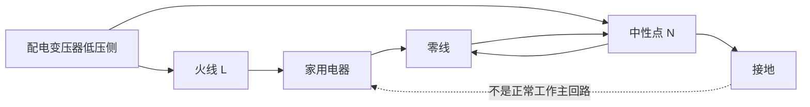
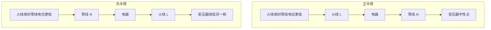

# 电路基本知识
正极为高电势，负极为低电势，电流由正极流向负极，有电流其实也就是有电子的移动，电子从负极流向正极（跟电流的方向相反，之所以相反是因为历史上电流的定义是在电子流动方向确定之前就已经确定了）。

电压是电势差的量度，单位是伏特（V）。

电流是电荷流动的量度，单位是安培（A）。

电阻是电流流动的阻碍，单位是欧姆（Ω）。根据欧姆定律，电压（V）等于电流（I）乘以电阻（R），即V = I * R。
电阻的决定式是R = ρ * (L / A)，其中ρ是材料的电阻率，L是导体的长度，A是导体的横截面积。
电阻的定义式是R = V / I，即电阻等于电压除以电流。

欧姆定律：V = I * R

直流电：电流的方向和大小保持不变，常见于电池和直流电源，简称DC（Direct Current）。
交流电：电流的方向和大小周期性变化，常见于家庭电源和交流发电机，简称AC（Alternating Current）。

## 家用交流电相关知识
正常工作时的回路可以理解为：火线 -> 电器 -> 零线 -> 变压器中性点 -> 变压器低压侧绕组 -> 再回到火线侧。

说明：
1. 正常工作电流主要走火线和零线构成的闭合回路。
2. 中性点接地的作用主要是稳定零线对地电位，并在故障时帮助保护装置动作。
3. 大地不是正常工作时的主要回流路径。

交流电与直流电不同，瞬时电流方向会随正半周和负半周不断反向。

说明：
1. 正半周时，瞬时电流方向可以看成火线 -> 电器 -> 零线。
2. 负半周时，瞬时电流方向会反过来。
3. 零线之所以叫零线，不是因为电流永远单向从它流回去，而是因为它与变压器中性点相连，对地电位通常接近 0V。

